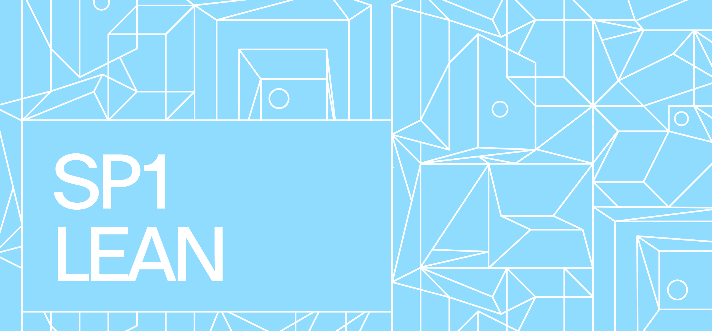

<div align="center">



Formal verification of SP1 Hypercube zkVM arithmetization

</div>

## Overview

A formal verification, in **Lean 4**, of the RISC-V chips in
[SP1](https://github.com/succinctlabs/sp1) — Succinct's zkVM.

SP1 proves the correct execution of a RISC-V program by encoding each instruction as rows of arithmetic
constraints across a family of *chips* (one per operation: add, sub, bitwise, comparison, …). Those
constraints are written in Rust. This project takes the constraints SP1's chips actually enforce and
proves, in Lean, that satisfying them forces the row to compute the right RISC-V result.

The circuits themselves are expressed in the [Clean](https://github.com/Verified-zkEVM/clean) zk-circuit
DSL, and the reference for what each instruction *should* do is the official
[Sail](https://github.com/riscv/sail-riscv) model of the RISC-V ISA. So a finished proof connects three
things: SP1's Rust constraints, the Clean circuit, and the RISC-V ISA.

### What is proven

- **Soundness** — if a chip's row satisfies its constraints, the row computes the result the RISC-V ISA
  specifies for that instruction (proved against the Sail model). Every soundness theorem is
  *axiom-clean* — `#print axioms` shows only Lean's standard axioms, no `sorry`.
- **Completeness** — because the circuits carry explicit witnesses, we also prove that every correct
  input is accepted (no spurious constraint rejects a valid row) — `sorry`-free for all 25 chips.
- **Faithfulness** — the constraints the Lean proof reasons about are *exactly* the constraints SP1's Rust
  code emits, so the proof can't be vacuously about a different circuit.

### What is assumed / out of scope

- The Sail model is taken as the ground-truth definition of RISC-V.
- The Clean DSL and the Lean toolchain are trusted.
- **Soundness and per-chip completeness are both `sorry`-free, across all 25 chips.** The single
  remaining `sorry` in the project is one premise of the whole-machine *capstone* — the decode seam
  (`sp1_witness_decode`), which binds the 25 witness tables to their decoded rows. It is a structural
  packaging premise, not a per-chip soundness or completeness gap, so it never weakens a chip-level
  claim. See [`docs/release-audit.md`](docs/release-audit.md) for the axiom inventory and
  [`docs/roadmap.md`](docs/roadmap.md) for the plan to close it.
- This is a per-chip, per-row result plus a trace-level composition layer; it is not yet an end-to-end
  proof of the whole zkVM.

## Code Structure

All Lean sources live under `SP1Clean/`, with a mirror-of-SP1 layout. The root index
`SP1Clean.lean` wires up every module's import.

### `FormalModel/Contracts/`
The input structs and specifications, stated against the RV64 ISA functions — what each reader, operation,
and chip is expected to compute.
- `Contracts/Readers.lean` — reader-circuit specs (CPU state, R-type reader, register-access columns/timestamps).
- `Contracts/Operations.lean` — operation-level specs.
- `Contracts/Chips.lean` — chip-row `Inputs` + semantic `Spec`s; `Contracts/ChipAssumptions.lean` adds the ALU chips' `Assumptions`/`ProverAssumptions`.
- `Trace/GuestProgram.lean` — the guest-program execution model (`GuestProgram`, `IsInitialState`, `SailChain`, `SP1Halted`).

### `Math/`
General math with no SP1/Sail dependencies (the upstreaming candidate). Everything works over a prime field.
- `Word.lean` — a `Word` as four little-endian 16-bit limbs, plus reassembly into a 64-bit value.
- `Bitwise.lean` — byte-level AND/OR/XOR.
- `MulCarryChain.lean` — multiplication carry-chain utilities.
- `HWord.lean`, `GetElemFastPath.lean`, `Misc.lean` — half-word lemmas, a vector-access shim, misc lemmas.

### `Model/`
The SP1 substrate — Sail wrappers and the lookup-bus model.
- `Register.lean`, `SailWrap.lean`, `SailMemory.lean` — register state, Sail monad wrappers, and the Sail memory model.
- `Channels.lean`, `ChipAir.lean`, `InteractionBus.lean`, `InteractionProjection.lean`,
  `InteractionRecovery.lean` — the model of the lookup buses chips use to talk to each other.
- `ByteTable.lean` — the static byte-lookup table (SP1's preprocessed `ByteChip`).
- `SP1Constraint.lean` — shared SP1 opcode datatypes (`ByteOpcode`, `Opcode`).

### `Native/Operations/` + `Proofs/Operations/`
The Clean circuit gadgets, one per operation (Add, Addw, Sub, Subw, Mul, Bitwise, BitwiseU16, Lt, U16Compare,
U16MSB, U16toU8, IsZero(Word), IsEqualWord, Address, AddrAdd), each proved to compute the right 64-bit result.
A structured op `<Op>/` is split across pillars: the witness + native arithmetic core
(`Native/Operations/<Op>/{Populate,RawSpec}.lean`), the `FormalAssertion` proof
(`Proofs/Operations/<Op>/Formal.lean`), and the auto-generated `eval` circuit (`Extracted/Circuit/<Op>.lean`).
Single-file (flat) ops live in `Native/Operations/`.

### `Native/Readers/`
Register-adapter reader circuits that validate register reads/writes and instruction fetches per row:
`CPUState.lean`, `RTypeReader.lean`, `ALUTypeReader.lean`, `RegisterAccessCols.lean`,
`RegisterAccessTimestamp.lean`.

### `Native/Chips/` + `Proofs/Chips/`
The chips: each composes the reader circuits, an operation gadget, and an `is_real` selector. A chip
`<Op>Chip/` is split across pillars — the `main` circuit (`Native/Chips/<Op>Chip/Defs.lean`) and the
soundness/completeness proofs + Sail bridge (`Proofs/Chips/<Op>Chip/{Formal,Bridge}.lean`); the `Spec` lives
in `FormalModel/Contracts/Chips.lean`. The ALU, control-flow, and memory chips are all here —
Add/Addi/Addw/Sub/Subw, Bitwise, Lt, Mul, DivRem, ShiftLeft/ShiftRight, AluX0, Branch, Jal/Jalr, UType, and
the Load*/Store*/LoadX0 memory chips — alongside the flat receiver-infra files `Proofs/Chips/ByteChip.lean`,
`ProgramChip.lean`, and `MemoryProvider.lean`. (The 3 entangled complex chips DivRem/ShiftLeft/ShiftRight
keep their `Defs` in `Proofs/Chips/` too.) Soundness is proved and `sorry`-free throughout; a few
completeness proofs are still deferred skeletons.

### `Faithful/`
The faithfulness layer: proofs that the constraints used in the chip proofs are exactly those SP1 emits,
plus witness-conformance checks (`*Witness.lean`) that the Lean witness matches SP1's `populate`. Shared
scaffolding in `ChipTactics.lean` and `WitnessConformance.lean`.

### `Extracted/`
A copy of SP1's constraints, mechanically extracted from the Rust via `sp1-constraint-compiler`. The
hand-written `ExtractionDSL.lean` defines the vocabulary these read in (a list of assertions plus lookup
interactions); the rest are the per-chip/op constraint lists, reader columns, and witness vectors.

### `Soundness/`
Trace-level consistency properties and the whole-machine capstone.
- `ChipRow.lean` — the `ChipKind` structure-of-functions each chip registers.
- `StateConsistency.lean` (PC chain), `MemoryConsistency.lean`, `ByteConsistency.lean`,
  `ProgramConsistency.lean` — per-bus consistency.
- `Opcode.lean` + `Coverage.lean` — the auditable `Opcode → chip → Sail` routing table (mirroring SP1's
  `RiscvAir`); `InstructionTrace.lean` maps an instruction sequence to a `ChipRow` sequence;
  `Completeness.lean` is the partial whole-VM-completeness layer.
- `GatedVm/` + `SP1GatedVm.lean` — the execution capstone (`sp1_machine_soundness`), the final
  Clean `FormalEnsemble`.

### `SP1CleanTest/` — the test library (`lake test`)
A separate top-level library (it imports `SP1Clean`, but is **not** part of the main `lake build`) holding
the conformance tests — the project's only `native_decide` (which trusts the whole compiler, so it is kept
out of the main library by `scripts/check_no_native_decide.sh`). Two layers: `WitnessTests/` checks each
operation's witness generator against explicit vectors dumped from SP1 (`<Op>Witness.lean` anchors +
auto-generated `WitnessTests/Vectors/`), and `TraceGenTests/` checks whole chip traces re-derived from each
chip's own circuit against SP1's real `generate_trace`. Shows conformance on test cases; doesn't directly
prove witness generation faithful. Run with `lake test`.

## How a proof connects to SP1

Each operation is verified through a short chain of artifacts that together link SP1's Rust, the Clean
circuit, and the RISC-V ISA:

1. **Gadget** (`Native/Operations/<Op>/` + `Proofs/Operations/<Op>/Formal.lean`) — the Clean circuit for the
   operation, with a spec describing the result it computes on 64-bit words.
2. **Chip** (`Native/Chips/<Op>Chip/Defs.lean` + `Proofs/Chips/<Op>Chip/Formal.lean`) — composes the gadget
   with the register/instruction *readers* and an `is_real` selector, matching the shape of one of SP1's chips.
3. **Sail bridge** (`Proofs/Chips/<Op>Chip/Bridge.lean`) — proves the chip's result matches the RISC-V ISA, as
   defined by the Sail model.
4. **Faithfulness anchor** (`Faithful/<Op>.lean`) — proves the constraints used above are exactly those SP1
   emits, drawn from a Rust-extracted copy of SP1's constraints under `Extracted/`.

Beyond a single row, chips talk to each other through lookup buses (registers, memory, the program ROM, a
byte table). These are modeled as a multiplicity-weighted interaction bus, with per-bus consistency lemmas
composed into a whole-trace result. See [`docs/bus-model.md`](docs/bus-model.md) for that layer.

## Building

```bash
# Build everything (the default target)
lake build SP1Clean
```

## Toolchain & Dependencies

All dependencies are fetched from public Git repositories by `lake build` — there is nothing to check out
by hand. They are pinned, and you should **not bump them**:

| Dependency | Version / source |
|------------|------------------|
| Lean       | `leanprover/lean4:v4.28.0` (`lean-toolchain`) |
| mathlib    | `github.com/leanprover-community/mathlib4 @ v4.28.0` |
| Clean      | `github.com/Verified-zkEVM/clean @ main` |
| `LeanRV64D` (Sail RV64 model) | `github.com/succinctlabs/sail-riscv-lean @ dtumad/clean-native` |
| `RISCV` (lightweight RV64 ISA fns) | `github.com/succinctlabs/riscv-lean @ dtumad/clean-native` |
| `Sail` (runtime) | `github.com/rems-project/lean-sail @ v4` (pulled in transitively) |

The two `succinctlabs/*` Sail dependencies are pinned to the `dtumad/clean-native` branch and each carries a
4.28 `lean-toolchain`; this is what keeps the project from being bumped to 4.29.
