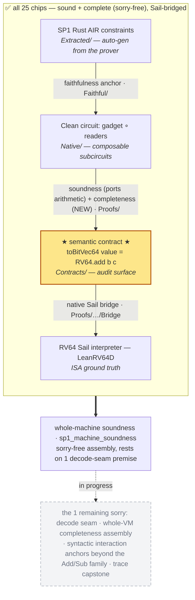

# EthProofs talk — SP1 in Clean (1 slide, 2–3 min)

> Speaker aid for the single slide. Render the Mermaid block as the slide's visual; the hero snippet
> is the callout; talking points are timed; backup facts are for Q&A. Audience has just seen a Clean
> intro talk, so assume they know the Clean DSL.

## Title + thesis

**SP1 in Clean: modular — and complete.**

> sp1-lean already proved SP1's RISC-V chips **sound** down to the RISC-V Sail spec — per chip,
> directly, soundness only. We rebuilt it on **Clean** as a **modular chain of small, composable,
> separately-proved artifacts**, scaled to **25 chips** and a whole-machine soundness theorem — and
> now prove **completeness too, `sorry`-free, for all 25**. Same Sail destination; a more general,
> more reliable foundation.

## Slide visual (Mermaid — render this)

Each edge is a separate theorem in a separate pillar — that *is* the separation-of-concerns story.



Optional small "before" caption beside the diagram:
`Before Clean (Lean 4.29, no Clean): per-chip constraints → soundness only → Sail directly (correct_* on LeanRV64D).`

## Hero snippet (the callout)

The chip's contract = its parts' contracts composed + the operation's meaning in RV64 ISA terms.
(`SP1Clean/FormalModel/Contracts/Chips.lean:65-77`, trimmed for the slide.)

```lean
def Spec input cols _ : Prop :=
  Readers.RTypeReader.Spec { … } ∧            -- the reader's OWN contract, reused
  (input.is_real = 0 ∨ input.is_real = 1) ∧
  (input.is_real = 1 →                         -- the meaning, in RV64 ISA terms
    Word.toBitVec64 cols.add_operation.value
      = RV64.add (toBitVec64 op_c_val) (toBitVec64 op_b_val))
```

Companion (soundness *ports* the arithmetic; completeness is the *new* direction —
`SP1Clean/Native/Operations/AddOperation/RawSpec.lean`):

```lean
addSemantics_of_carries   -- soundness: ports the arithmetic math core
carries_of_addSemantics   -- completeness: the NEW direction (valid input ⟹ accepted)
```

## Talking points (~2:30, hard cap 3:00)

- **Hook (~20s).** You've just seen Clean — we used it to rebuild SP1's RISC-V chip verification.
  sp1-lean already proved these chips **sound** down to the RISC-V Sail spec; what changed is a
  **modular architecture**, and we now prove **completeness** too.
- **Before Clean (~20s).** The original was per-chip and direct — each chip's constraints, a soundness
  proof straight to the Sail model. Correct, but soundness only, chip by chip, on a pinned older
  toolchain.
- **The new shape — separation of concerns (~45s).** Each operation is now **four separate
  artifacts**, each its own theorem in its own layer [point at the diagram]: a Clean circuit built by
  *composing* sub-circuits — a gadget plus the register-readers — so a chip's spec is literally its
  parts' specs composed; the **meaning** as its own contract on an *audit surface*, written in RV64
  ISA terms [point at the hero snippet]; a *native* Sail bridge; and a **faithfulness anchor** tying
  the circuit's constraints to SP1's actual extracted constraints. Because it composes, we scaled it
  to **25 chips** and one whole-machine soundness theorem.
- **Completeness is new (~30s).** Soundness largely *ports the existing arithmetic*. What's genuinely
  **new is completeness** — because the circuits carry explicit witnesses, we prove every valid input
  is *accepted*, now **`sorry`-free for all 25 chips**. The no-Clean version had no completeness at all.
- **More reliable (~20s).** Per-chip soundness is **axiom-clean** — `#print axioms` shows the three
  standard Lean axioms — and `sorry`-free, on public Clean + Lean 4.28. **One `sorry` remains in the
  entire project**: a structural decode-seam premise the whole-machine capstone rests on — not a hole
  in any chip.
- **Close (~15s).** Same Sail destination, a more general and more trustworthy foundation: modular,
  composable, **complete**, axiom-clean.

## Backup facts (Q&A — not on the slide)

- **25** wired RV64IM chips; **soundness + completeness both `sorry`-free for all 25** (verified: the
  table of all 25 chip circuits, `sp1Tables`, has **no `sorryAx`**).
- **One** `sorry` in the whole project: `sp1_witness_decode` (the decode seam, `SP1GatedVm.lean`) — a
  structural premise binding the 25 witness tables to decoded rows; the whole-machine soundness
  capstone rests on it. Not a per-chip gap.
- **Axioms** (`#print axioms`): a typical chip's soundness, and DivRem's completeness, are
  `[propext, Classical.choice, Quot.sound]`. `bv_decide` adds `ofReduceBool`/`trustCompiler` on
  `Mul`/`Bitwise` soundness. `native_decide` lives only in the separate `SP1CleanTest` library.
- **Baseline** = the no-Clean sp1-lean (Lean **4.29**, olean-based): **soundness only**, reached Sail
  **directly** (`correct_*` on the LeanRV64D model — no `SailBridge`), old Add ≈ **222 lines**. So the
  contrast is **architecture + completeness**, *not* size.
- Both old and new reach the **RISC-V Sail spec**. Clean-native states meaning via the **RV64 ISA
  functions** (`RV64.add` = `rs1+rs2`, from `riscv-lean`) then bridges to the full **LeanRV64D** Sail
  interpreter; the no-Clean version used LeanRV64D's `execute` directly.
- Build: **3628 jobs**, clean. Coverage ≈ **50 of 122** `RiscvAir` variants.
- Honest *global* caveat (if pressed): per-chip completeness is done; the **whole-VM** completeness
  *assembly* (stitching per-row witnesses into one balanced trace) is still future work — the
  program-level dual of the decode seam.

## Honesty guardrails (don't overstate on stage)

- "Complete for all 25 chips" = **per-chip** completeness (valid input ⟹ accepting row), `sorry`-free.
  The whole-VM completeness assembly is still open — say so if asked.
- The capstone `sp1_machine_soundness` is a `sorry`-free *assembly* that **rests on** the one
  decode-seam premise (it carries that `sorryAx`); the per-chip theorems are axiom-clean. Don't call
  the capstone itself "axiom-clean."
- Don't attribute `SailBridge`/`fromMain`/`toMain` or any "half the size" win to the no-Clean baseline
  — those were a *Clean-prototype* phase / a different comparison.

## Sources (verified 2026-06-25)

- Hero: `SP1Clean/FormalModel/Contracts/Chips.lean:65-77`; lemmas in `…/AddOperation/RawSpec.lean`.
- Completeness registry (all 25): `SP1Clean/Soundness/Completeness.lean` (`completeChipNames.length = 25`,
  `incomplete_wired_names = []`). DivRem completeness: `…/DivRemChip/Completeness/Driver.lean` (`completeness`).
- Capstone + seam: `SP1Clean/Soundness/SP1GatedVm.lean` (`sp1_machine_soundness`; the lone `sorry`).
- Axiom check (this session): `sp1Tables` → no `sorryAx`; `DivRemChip.completeness` → `[propext,
  Classical.choice, Quot.sound]`; `sp1_machine_soundness` → `… sorryAx … ofReduceBool, trustCompiler …`.
- Old baseline: `git show f302bc0~1:SP1Chips/AddChip.lean` (direct-to-Sail, soundness only; Lean 4.29).
- `RV64.add`: `.lake/packages/RISCV/RISCV/Instructions.lean:116` (`rs1_val + rs2_val`).
